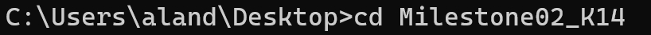
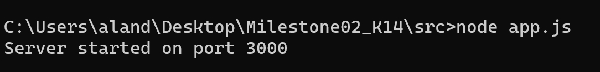

# PortalMahasiswaITB
Sebagai seorang mahasiswa/i di sebuah kampus ternama, waktu dan tenaga menjadi hal yang sangat terbatas dan mulai harus dijadikan prioritas untuk diperhatikan. Pertimbangan Ini lah yang mendorong kami untuk membuat solusi inovatif yang berdampak bagi mahasiswa ITB.

## Cara menjalankan website Portal Mahasiswa ITB
1. Clone repository "PortalMahasiswaITB" pada device kalian
2. Install node js pada link ini (https://nodejs.org/en/download) dan jalankan npm install
3. Change directory ke dalam folder PortalMahasiswaITB seperti pada gambar dibawah!

4. Dalam folder PortalMahasiswaITB change directory ke folder src seperti pada gambar dibawah!

5. Ketik "node app.js" di terminal seperti pada gambar dibawah!

6. Jalankan http://localhost:3000/portal pada browser kalian!
